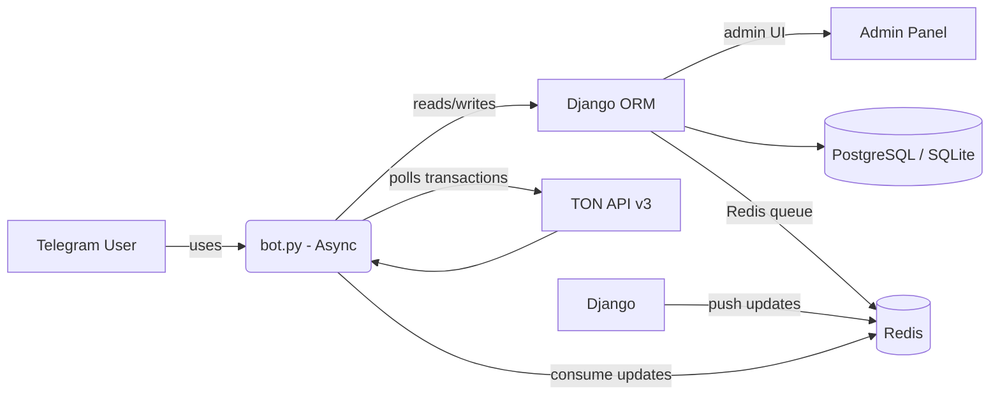

# Telegram Store Bot with Django Webhook Integration 🛒⚡📢

   

A Python-based Telegram store bot integrated with a Django backend, featuring **webhook support**, Redis queueing, and async background tasks. Users can **browse products, top up balances using TON cryptocurrency, and purchase items** — all from Telegram.

This code is based on [telegram-store-bot](https://github.com/RezaTaheri01/telegram-store-bot) but adapted for **webhook architecture**.

---

## Table of Contents
- [Features ✨](#features)
-  [Highlights 🚀](#highlights)
- [Setup & Installation 🛠️](#setup--installation)
- [Bot Commands 📋](#bot-commands)
- [Webhook & Redis Overview 🧭](#webhook--redis-overview)
- [Database Notes ⚙️](#database-notes)
- [Best Practices ✅](#best-practices)
- [Architecture Diagram 🧩](#architecture-diagram)
- [Security & Privacy 🔐](#security--privacy)
- [Testing & Development 🧪](#testing--development)
- [License 📜](#license)
- [Disclaimer 🤖](#disclaimer)

---

## Features

* Product browsing by categories 🏷️
* Purchase products using TON cryptocurrency 💰
* Generate TON payment links 🔗
* Track user transactions and purchase history 📝
* Background tasks:
  - TON price updater
  - TON transaction processor
  - Redis consumer for webhook queue
* Multi-language support 🌐
* Timezone handling ⏰

---

## Highlights

* **Webhook Integration**: Efficient Telegram update handling with Uvicorn. 🌐
* **Redis Queue**: Django receives webhooks → pushes to Redis → async bot consumes. ⚡
* **Async Background Tasks**: Runs safely alongside update processing.
* **TON Center API v3** integration ensures no on-chain transactions are skipped.
* Atomic, idempotent transaction processing prevents double-crediting.
* LRUCache for recent TX deduplication; TTL caches for settings and price.
* Clear separation: Django for admin & ORM; bot runs independently.

---

## Setup & Installation

1. **Clone repository:**

```bash
git clone --branch TON-payment https://github.com/RezaTaheri01/telegram-store-bot-web-hook.git
cd telegram-store-bot-web-hook/telegram_store
```

2. **Install dependencies:**

```bash
pip install --upgrade pip
pip install -r req.txt
```

3. **Configure `.env` file:**

```env
# Bot Token (@BotFather)
TOKEN=your-telegram-api-token
BOT_LINK=https://t.me/giftShop2025Bot

# Command to refresh bot cache
UPDATE_SETTING_COMMAND=update

# Django secret key
SECRET_KEY=CHANGE_ME_IN_PRODUCTION

DEBUG=True
ALLOWED_HOSTS=localhost,127.0.0.1,your-domain.com,www.your-domain.com
ADMIN_URL=adminadmin

# Redis URL (used by bot and Django)
REDIS_URL=redis://localhost:6379/0
TELEGRAM_WEBHOOK_SECRET=telegram

# Optional: Site domain
# SITE_DOMAIN=https://your-domain.com

# Database (example)
#DB_ENGINE=postgresql
#DB_NAME=mydb
#DB_USER=postgres
#DB_PASS=secret123
#DB_HOST=localhost
#DB_PORT=5432
```

> Note: For local testing, use a tunnel (e.g., Ngrok or Cloudflare Tunnel) to expose HTTPS for webhooks.

4. **Run migrations & create superuser:**

```bash
python manage.py makemigrations users payment products
python manage.py migrate
python manage.py createsuperuser
```

5. **Start Django web server:**

```bash
uvicorn telegram_store.asgi:application --host 0.0.0.0 --port 8000
```

**Production**: use **Gunicorn** or **Uvicorn** with multiple workers for webhook handling

6. **Create BotSettings in Django admin** (mandatory **before starting the bot**):

- Open Django admin: `https://your-domain.com/adminadmin`  
- Create a new `BotSetting` entry with at least:  
  - Wallet Currency (e.g., USD)  
  - TON Price Delay (seconds, e.g., 120)  
  - TON Fetch Limit (e.g., 250)  
  - TON Network Delay (seconds, e.g., 10)  
  - Optional: Disable product images for faster UI


7. **Start Redis server / connect to Redis**

Redis is used as a **message queue** between the Django webhook and the async bot worker.

**Flow:**

```
Telegram → Django webhook → Redis → Bot worker
```

You can also run Redis via **Docker** (cross-platform, recommended).

---

#### Install Redis (Linux / WSL)

```bash
sudo apt update
sudo apt install redis-server
```

Start Redis and enable it on boot:

```bash
sudo systemctl start redis
sudo systemctl enable redis
```

Verify Redis is running:

```bash
redis-cli ping
# PONG
```

---

#### Configure Redis connection

Set Redis connection in `.env`:

```env
REDIS_URL=redis://localhost:6379/0
```

---

#### Production

Use a **managed Redis service** or a **dedicated Redis instance**.

Ensure the `REDIS_URL` in `.env` matches your Redis instance and is reachable by **both Django and the bot worker**.

8. **Set Telegram webhook** (one-time):

```bash
curl -F "url=https://your-domain.com/webhook/TELEGRAM_WEBHOOK_SECRET/" https://api.telegram.org/bot<TOKEN>/setWebhook
```

9. **Start bot worker:**

```bash
python bot.py
```

**Production**: run as a background service, via `nohup`, **systemd**, or **Docker**, so it stays alive and automatically restarts if it crashes.

> The bot will now consume updates from Redis and process background tasks.

---

## Bot Commands

* `/start` – Start bot and show main menu  
* `/menu` – Show main menu  
* `/balance` – Check balance  
* `/pay` – Generate TON payment link  
* `/set_timezone` – Set timezone (requires location)  
* `Update Settings` – Refresh bot settings

---

## Webhook & Redis Overview

1. **Telegram → Django webhook**: Updates arrive at Django endpoint.  
2. **Django → Redis**: Update JSON is pushed to `telegram_updates` list.  
3. **Bot worker**: Async consumer pops updates from Redis and processes them.  
4. **Background tasks**:  
   - TON price updater  
   - TON transaction processor  
   - Any other periodic tasks run alongside update processing

This ensures **reliable async processing** and avoids blocking webhook requests.

---

## Database Notes

* `TonCursor`: tracks last processed transaction (`last_lt`, `last_hash`)  
* `Transaction.tx_id`: unique for each payment  
* `ProductDetail`: inventory rows; lock **one row per purchase** with `select_for_update(skip_locked=True)`

---

## Best Practices

* Use **PostgreSQL** in production for safe row-level locking.  
* Keep `TON Fetch Limit` moderate (100–500).  
* Monitor LRU cache size (default: 10,000 entries).  
* Run bot as a **separate background worker**.  
* Separate **web (Django)** and **bot (worker)** processes.

---

## Architecture Diagram



---

## Security & Privacy

* Keep `SECRET_KEY` and API keys out of source control  
* Use **HTTPS** for webhooks  
* Validate and sanitize user input  
* Limit access to Redis for internal services only

---

## Testing & Development

* Manual testing for payments recommended  
* Unit tests suggested for:
  - `apply_transaction()` atomic behavior  
  - `TonCursor` updates  
  - Polling & webhook edge cases  

---

## License

GPL-3.0 — see `LICENSE` file.

---

## Disclaimer

Parts of this README were assisted by AI. All final code and implementation decisions were made manually by the author.
